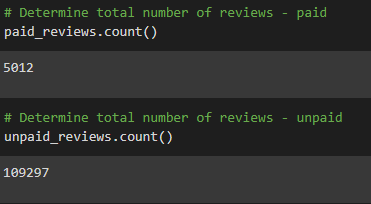
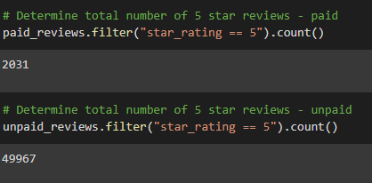
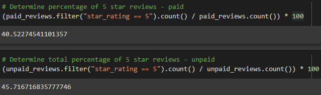

# ETL on Amazon Reviews with PySpark Challenge

## Overview
The goal of this project is to examine if there is bias evident in the reviews of products provided to members of the Amazon Vine program. More specifically, we are looking to see if being a paid review will impact the percentage of 5 star reviews.

For this analysis, books were the dataset that was selected. Then, using PySpark, a new dataframe was made with only the review id, the star rating given, how many "helpful" votes the review received, how many total votes the review received, whether the review was from the vine program, and whether or not the review came from a verified purchase. Using this, the overall combined reviews -- the total paid and unpaid five star reviews were pulled from the data -- and the percentage of five star reviews was calculated.

## Results

- 114,309 is the total reviews present in this dataset.

- 5,012 of the reviews were paid. 

- 109,297 of the reviews were unpaid. 

- The overwhelming majority of reviews, regardless of star rating, are unpaid. Only 4% are paid reviews.

- 2,031 of the 5,012 paid reviews are 5 star reviews.

- 49,967 of the 109,297 unpaid reviews are 5 star reviews.

- 41% of paid reviews were 5 star reviews.

- 46% of unpaid reviews were 5 star reviews.

## Summary
On the surface, there does not appear to be positivity bias present in paid book reviews. Unpaid reviews have a higher percentage of 5 star reviews even, 46% compared to 41% among paid reviews. However, even accounting for the overall sizes of the pools, that being very large and very small respectively, I do not think we can say definitively whether positivity bias is present or not.

In an attempt to better discern whether bias is present, I think we need to account for the individual products. Multiple New York Time's bestsellers could have hundreds or even thousands of 5 star reviews that skew our findings. How many books are these 5 star ratings spread across? Do any of these books only have 5 star ratings from paid reviews? These are important questions that cannot be ignored, and without them, or other questions in a similar vein, we cannot truly know if positivity bias is present in the paid reviews or not.
